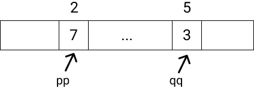

# Sorting


## qsort 

```c
#include <stdlib.h>

int a[100];
/* assume we've stored 100 ints in a */

/* qsort uses select-sort: compare and swap */
qsort(a, 100, sizeof(a[0]), cmp);
/* 1st par: array name */
/* 2nd par: length of array */
/* 3rd par: size of each element */
/* 4th par: comparison function used to specify sorting order */
```

-   `qsort` calls `cmp` when it needs to compare 2 elements of the array


### cmp

Then what is the **prototype of `cmp`**? 

```c
int cmp(const void *p, const void *q);
```


#### cmp input

-   `qsort` passes in the addresses of the elements if wants to compare to `cmp`. 

    

#### cmp output

-   `cmp` should return a ***negative*** value if `*p` should go ***before*** `*q` after sorting. 
-   `cmp` should return a ***positive***  value if `*p` should go ***after***    `*q` after sorting. 

-   `cmp` should return ***0*** if it does ***not matter*** which of the two goes first. 

**Note**: `*p`, `*q` are elements pointed to by `p` and `q`, respectively.


#### Sorting integers in ascending order: bigger 3 goes after smaller #

```c
int cmp(const void *p, const void *q) {
  const int *pp = p;
  const int *qq = q;
  return *pp - *qq; 
  /* for decending order, use: *qq - *pp */
  /* return positive number */
}
```




## Example: sorting structures with int and string

-   Sort in **descencding order of scores [Primary]** 
-   and, if several grades have the same score, they are then sorted in **ascending order of their id's [Secondary]**

```c
typedef struct {
	char id[10];
	int score;
} grade;

grade a[85]; 
/* assume we've stored 85 grades in a */

qsort(a, 85, sizeof(a[0]), cmp);
/* Note: cmp can be any name */

int cmp(const void *p, const void *q) {
	const grade *pp = p;
  const grade *qq = q;
  int n = qq -> score - pp -> score;
  if(n != 0)
    return n;
  return strcmp(pp -> id, qq -> id);
}
```


## Example: sorting an array of "strings"

```c
char *a[] = {"hello", "world", "goodbye", ...};
/* a: array of pointers */
qsort(a, sizeof(a)/sizeof(a[0]), sizeof(a[0]), cmp);

int cmp(const void *p, const void *q) {
  char * const *pp = p;
  char * const *qq = q;
  return strcmp(*pp, *qq);
  /* ascending order */
}
  
  
char **pp = p; (X)
const char **pp = p; (X)
char * const *pp = p; (O)
/* pp is a pointer to const pointer to char */
```


## `readlines.c` with sorting

```c
#include <stdio.h>
#include <stdlib.h>
#include <string.h>
#include <ctype.h>
#define BUFSIZE 1024
#define BLOCK   10

int isblank(const char *s) {
    size_t i;
    for (i = 0; s[i] != '\0'; i++) {
        if(!isspace(s[i]))
        return 0;
    }
    return 1;
}

int cmp(const void *p, const void *q) {
  char * const *pp = p;
  char * const *qq = q;
  
  return strcmp(*pp, *qq);
}

int main(void) {
	char **lines;
	char buffer[BUFSIZE];
	size_t i, nalloc, nused;
  
  lines = 0;
  nalloc = nused = 0;
  
  while(fgets(buffer, BUFSIZE, stdin)) {
    if (isblank(buffer))
        continue;
    if (nused == nalloc) {
      char **temp = realloc(lines, (nalloc + BLOCK) * sizeof(char*));
      if (temp == 0) {
        fprintf(stderr, "realloc failed\n");
        break;
      }
      lines = temp;
      nalloc += BLOCK;
    }
    lines[nused] = malloc(strlen(buffer) + 1);
    if (lines[nused] == 0) {
      fprintf(stderr, "malloc failed\n");
      break;
    }
    strcpy(lines[nused++], buffer);
  }
  
  qsort(lines, nused, sizeof(lines[0]), cmp);
  for(i = 0; i < nused; i++)
    printf("%s", lines[i]);
  
  for(i = 0; i<nused; i++)
    free(lines[i]);
}
```


### What is the prototype of `qsort`?

```c
void qsort(void *, size_t, size_t, ???);
/* ??? is a function pointer */
```


Look at `COMP 2510 - Nov 7 - Function Pointer.md`


## Example records.c

```c
#include <stdio.h>
#include <stdlib.h>
#include <string.h>

typedef struct {
    char id[10];
    int score;
} grade;

int read_grade(grade *p) {
    return scanf("%s %d", p->id, &p -> score) == 2;
}

void print_grade(const grade *p) {
    printf("%s: %d\n", p->id, p->score);
}

int cmp(const void *p, const void *q) {
    const grade *pp = p;
    const grade *qq = q;
    int n;
    if ((n = qq->score - pp->score) != 0) 
        return n;
    
    return strcmp(pp->id, qq->id);
}

int main(void) {
    grade a[100];
    size_t i, j;
    for (i = 0; i < 100; i++) 
        if (!read_grade(&a[i]))
            break;
    
    qsort(a, i, sizeof(a[0]), cmp);

    for(j = 0; j < i; j++) 
    print_grade(&a[j]);

    return 0;
        
}
```

